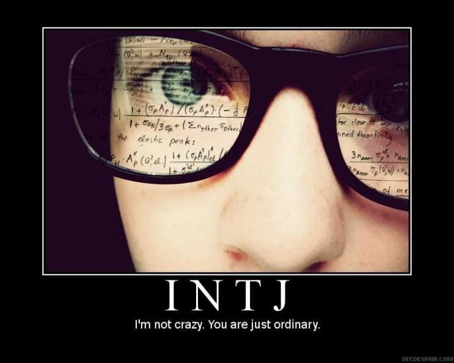
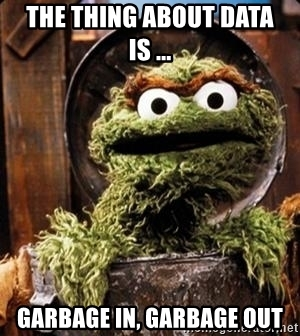

```{r setup, include=FALSE}
knitr::opts_chunk$set(echo = FALSE)
```

### Архитект (**INTJ-A / INTJ-T**)

*Самотно е на върха и като един от най-редките типове с най-развити стратегически способности, Архитектът отлично знае това. Архитектите формират само два процента от населението, а жените от този тип са особено редки, като представляват само 0,8% от населението -- често за тях е предизвикателство да намерят сходни личности, които могат да са в крак с тяхното неуморно интелектуално маневриране като в игра на шах. Хората с личностен тип Архитект притежават въображение и все пак са решителни; амбициозни, но прикрити; изумително любопитни, без да разпиляват енергията си.*



Това беше първият ми сблъсък с Myers-Briggs теста преди около 13 години, когато с повечето ми съученици правехме различни тестове за кариерно ориентиране, а откъсът е описанието на моят "личностен тип" [**INTJ-A / INTJ-T или Архитект**](https://www.16personalities.com/bg/личностен-тип-intj)**.** Няма да забравя колко специален и уникален се почувствах, когато прочетох, че принадлежа към една толкова рядка категория "изумително любопитни и амбициозни" хора. 😄

Въпреки голямата си популярност, този тест категорично се проваля при прогнозирането на бъдещо поведение (poor validity) и често дава различни резултати за един и същи човек в рамките на няколко седмици (poor reliability). В този блог пост ще разгледам Myers-Briggs теста през призмата на няколко различни научни парадигми, за да се убедим как той всъщност е точно толкова точен в прогнозите си колкото астрологията.

### **Myers-Briggs Type Indicator**

Myers-Briggs тестът несъмнено е най-популярният тест за установяване на личностния тип, който е базиран на теориите за личноста на Карл Юнг и в чиято основа са идеите, че всички хора имат вродени характерни черти, като интровертност или екстровертност, рационално или емоционално вземане на решения и други, които ги формират като "личности".


Типологията е разработена от тандемът майка-дъщеря - Катарин Бригс и Изабел Бригс Майерс, нито една от които няма психологическо образование или какъвто и да е опит в създаването на [психометрични](https://bg.wikipedia.org/wiki/Психометрия "https://bg.wikipedia.org/wiki/Психометрия") методи.

Резултатът за жалост е инструмент, който не е базиран на научен модел и не е валидиран въпреки безбройните опити за това, които продължават и до днес [@Stein2019-bs]. С други думи резултатите от теста не могат да бъдат използвани за прогнозирането на бъдещо поведение или резултати като например успешно справяне с работните задачи, ангажираност с работния процес, оценки на изпити . Причините за това са много - някои са свързани със самия тест, а други са просто общи недостатъци на психометричните инструменти за тестване на личностните типове и дупки в теориите на личностната психология като цяло.

### Теоретична основа

[Карл Густав Юнг](https://bg.wikipedia.org/wiki/Карл_Густав_Юнг) със сигурност е едно от най-популярните имена в психологията дори и днес. (В България е изключително високо ценен в някои кръгове, най-вече от определени психотерапевтични школи). Юнг има изключително широк спектър от интереси и в творчеството си комбинира познания от митологията, религията, антропологията, изкуството. За съжаление обаче теориите му (както и тези на неговият приятел, колега и ментор Зигмунд Фройд) са създадени доста преди модерните научни разбирания за [фалсифицируемост](https://bg.wikipedia.org/wiki/Фалсифицируемост) и емпирична верификация[@Popper1959-me], и следователно не отговарят на съвременните представи за научна теория в социалните или поведенчески науки. Идеите на Юнг са базирани основно на аргументация и на субективни наблюдения, а самият той е смятал, че ненаучният характер на идеите му е предимство, а не недостатък. [@Stein2019-bs]

Популярността му навярно се дължи на феномен наречен "гуру ефекта", предложен за първи път от Dan Sperber или склонноста на хората да вярват, че неясно звучащи твърдения идващи от авторитетни фигури носят някаква дълбока мъдрост и истина[@Sperber2010-bo]. Този феномен може да обясни популярността на фигури като Фройд, Юнг или Жак Лакан.

Излиза, че тестът Myers-Briggs се проваля още в теоретична си основа, което според някои е достатъчна причина да го критикуваме и да подлагаме на съмнение резултатите от него. Нека обаче да разгледаме още няколко теоретични и практически проблема.

### **Интроверт или екстроверт**

Първият сериозен проблем на MBTI е използването на дихотомично разделение при всички типологии (**Сетивност или Интуиция , и т.н.**), вместо използването на непрекъсната последователност. Дихотомично буквално означава разделение по двойки, например - мъжки и женски. Нека да се концентрираме за момента върху скалата **Екстровертност - Интровертност**. Разделянето на интроверти и екстроверти обаче е като да разделиш хората на ниски и високи, т.е. създателите на теста се опитват да ограничат екстровертността и интровертността до просто две категории.

От бърз преглед на литературата виждаме, че повечето хора са по средата, което означава, че разделяме на две категории индивиди, които са всъщност доста близко едни до други. Това е като да кажем всички хора които са по-високи от 178 см са високи, а под 178 см са ниски и да имаме един човек висок 177 см, който да попадне в категорията на ниските, а след това друг с ръст 179 см, когото да категоризираме като висок, макар разликата между двамата да е едва 2 см. Да вземем накрая и един индивид с височина 210 см - в дихотомичното ни разделение той ще се смята като висок естествено, което ще го сложи в една категория с индивида висок 179 см, въпреки разликата от 31 см (графика 1). Това е и проблемът в дихотомичната класификацията, която използва Myers-Briggs.

```{r, include=FALSE}
library(plotly)

x <- c('Иван', 'Георги', 'Петър', 'Делян', 'Васил', 'Борислав', 'Кирил', 'Йордан', 'Веселин', 'Чавдар', 'Николай', 'Светослав')
height <- c(152, 179, 184, 176, 184, 167, 210, 178, 185, 186, 169, 170)
data <- data.frame(x, height)
data <- data[order(height),] 
```

```{r}

vline <- function(x = 0, color = "black") {
  list(
    type = "line",
    y0 = 0,
    y1 = 20,
    yref = "paper",
    x0 = x,
    x1 = x,
    line = list(color = color, dash="dot")
  )
}


fig <- plot_ly(data, x = ~x, y = ~height, type = 'bar', name = 'Височина', marker = list(color = 'rgb(204,204,204)'))
fig <- fig %>% layout(xaxis = list(title = "Графика 1", tickangle = -45, tickvals = c("Йордан", "Георги", "Кирил"), categoryorder = "array",categoryarray = ~height), shapes = list(vline(16.5), list(type = "rect", fillcolor = "red", line = list(color = "red"), opacity = 0.2,y0 = 0, y1 = 215, x0 = 10.5, x1 = 16.5), list(type = "rect", fillcolor = "blue", text = 'Високи', line = list(color = "blue"), opacity = 0.2,y0 = 0, y1 = 215, x0 = 16.5, x1 = 22.5)),  yaxis = list(title = "Височина в см"), margin = list(b = 100))%>%
add_text(showlegend = FALSE, x = c("Йордан", "Георги"), y = c(210, 210), text = c("Ниски", "Високи"), hoverinfo = "none")

fig
```

Друг сериозен проблем е социалната динамика - настроението и стила на комуникация на хората се променя и никой не е екстровертен (или интровертен) във всеки един момент от живота си. Дори на екстровертите им се случва да са тъжни и да предпочетат да останат вкъщи, вместо да отидат на поредното парти.

Единствената класификация, която има теоретична основа в тази типология, всъщност е разглежданата до момента, а именно по линията интроверт - екстроверт. Останалите класификации - **Сетивност или Интуиция**, **Мислене или Чувстване**, **Съждение или Възприятие** - нямат никаква теоретична основа и не присъстват никъде в научната литература. А в случая на **Мислене или Чувстване**, които са противоположности в Myers-Briggs, дори има изследвания, които намират корелация между двете, а именно, че хората с по-добри способности да разсъждават и да се обосновават също така показват по-добри умения за разпознаване и контролиране на емоциите. [@Cote2006-jt]

От всичко личи, че Myers-Briggs има сериозни проблеми на теоретично ниво. Защо обаче е толкова успешен, въпреки липсата на емпирични доказателства?

### Garbage in - Garbage out

Статистическите модели (или процедури при някои парадигми на статистиката) се нуждаят първо от качествен теоретичен модел и после от качествени данни, за да могат да дават надеждни прогнози. (или както гласи популярен в програмирането израз : Garbage in - Garbage out)



За съжаление при Myers-Briggs теста липсва достатъчно качествена информация, която да подадем към един статистически модел,а на изхода (или резултата) получаваме гигантска информация , също като при хороскоп. В случая получаваме категория, от която се очаква да обяснява и прогнозира поведението на всички хора, които попадат в нея. Човешкото поведение е изключително сложен научен феномен, който зависи от множество фактори и те често си взаимодействат помежду си - културни, социални, биологически, икономически.

Не е реалистично да очакваме резултатите от един тест с десетина въпроса да ни дадат толкова богата картина за един индивид, която да е достатъчна, за да прогнозираме поведението му в различни ситуации, житейски стадий, или професионалният успех на дадена позиция. Подобни изследвания в психологията на личността има много и един от моделите с най-сериозно присъствие в психологическата литература е Петфакторния модел за личностните черти, известен като още Big 5 [@Roccas2002-ub]. Той обаче разчита на много богат теоретичен модел в комбинация с грижливо подбрани данни. В него изследователите събират много допълнителни данни, като например демографски, социо-икономически или експериментални, с които са валидирали модела в различни контексти.

#### **Аз отдавам това на две основни причини:**

1.  Всички типове в типологията са положителни по един или друг начин. В Myers-Briggs няма място за психопати, загубеняци или мързели. Затова тестът кара хората да се чувстват добре, типовете са забавни и предоставят тема за разговор (т.е. могат да стимулират социализиране), което ги прави културно атрактивни. От културната еволюция знаем, че информация с подобни свойства обикновено има потенциала да се разпространява лесно и успешно [@Morin2016-uh; @Sperber2004-ns]. Освен това личностните типове са много общи и неясно формулирани с цел да прилягат на възможно най-голям кръг хора, което от своя страна подсилва културната атрактивност допълнително. Този феномен е известен още като [**Ефектът на Форер**](https://bg.wikipedia.org/wiki/Ефект_на_Форер "https://bg.wikipedia.org/wiki/Ефект_на_Форер") и се счита като един факторите, които водят до популярността на астрологията.

2.  Попадането в определен личностен тип, дава на индивида групова принадлежност, а от социалната психология знаем, че хората имаме еволюционна нужда да принадлежим на групи сходни на нас човешки същества. [@Baumeister1995-vg; @Allen2020-ho]

### Какво прави **тестовете за определяне на личностния тип ненадежден метод за прогнозирането на човешко поведение**

Дотук разглеждахме проблемите конкретно на Myers-Briggs индикаторът. За съжаление обаче не само този инструмент има проблеми с надеждността, всъщност повечето тестове за определяне на личностен тип всъщност нямат добра прогнозна способност (predictive power). Проблемите на тези тестове са основно методологически и ще разгледам само двете най-големи според мен :

-   разчита на самоотчети (self-report данни)

-   базиран на WEIRD популация

### **Самоотчетите**

Друг сериозен недостатък е разчитането на т.нар. self-report данни (самоотчети). Използването на самоотчети в психологията се налага като водещ тренд в последните 50 години. Предимствата им особено в ерата на Интернет са много - лесни и евтини са за подготвяне и разпостранение, могат да дадат отговори за убеждения, мисли и емоции, както и други интроспективни характеристики на индивида, за което все още няма алтернативен метод. Имат обаче и своите сериозни недостатъци и в България много често наблюдаваме това по време на избори, когато почти винаги има сериозни разминавания между "проучванията" на социологическите агенции непосредствено преди изборите (разчитащи основно на самоотчети) и крайните резултати. Ето само някои от тях :

-   много хора не отговарят честно на анкетите, особено ако според тях отговорът не е социално приемлив [@Krumpal2013-xk]

-   голяма част от хората не са способни да се оценят точно или обективно, защото в повечето случаи мотивациите, предпочитанията и убежденията на индивидите са продукт на сложни културни и социални процеси, които са автоматични и несъзнателни (следователно невидими за тях) и е невъзможно да бъдат обяснени чрез интроспективни размишления [@Henrich2016-mm, 210].

-   хората, които се съгласяват да попълнят дадена анкета или да бъдат инервюирани не винаги са представителни за популацията, която се изследва (например опитайте се да хванете някой от твърдия електорат на "Възраждане" да попълни анкета за политиките за културен обмен на ЕС 😀 ). С други думи базирайки изследването си на доброволна извадка, или участници, които са се съгласили да отговорят на нашите въпроси, ние добавяме в резултатите си bias (*пристрастие*) към тази извадка. В икономическата литература това се нарича endogenous selection, а в каузалният анализ феноменът, който произлиза от това се казва collider bias.

### **Базирани на WEIRD популация**

През последните две деситилетия психологията претърпява сериозна методологическа революция, породена от множеството провалили се репликации на експерименти (т.нар. „[replication crisis](https://en.wikipedia.org/wiki/Replication_crisis)"). Едно от основните течения в тази революция произлиза от зародилата се през 80-те години интердисциплинарна теория на културната еволюция[@Boyd1985-fs]. Изследванията в областта на културната еволюция се характеризитат с изучаването на това как културните особености (например убеждения и модели на поведение) се стабилизират, променят и разпространяват в популациите. [@Mesoudi2006-wh]

През 2010 година Джоузеф Хенрич и колегите му публикуват много влиятелна статия [@Henrich2010-bi], която разкрива, че всъщност за по-голямата част от изследванията в областта на психологията и поведенческите науки са използвани участници от популации, за които се оказва, че са сред най-малко представителните, които да бъдат използвани за основа върху която да генерализираме човешкото поведение. Те наричат тази група общества Western, Educated, Industrialized, Rich, and Democratic (WEIRD), и в нея влизат основно държави като САЩ, Канада, държавите от Западна и Северна Европа, Австралия.

И така повечето психолози смятат, че моделите и измеренията на личността, наблюдавани сред американците и други хора от западни общества, до голяма степен представляват общочовешкия модел на поведение [@Henrich2020-pl]. Това е изцяло WEIRD предубеждение, което не важи в по-голямата част от останалия свят, въпреки че заради огромното влияние на западните държави над глобалната култура, вече навярно може да се наблюдава в други култури. Вместо това ако приемем за верен еволюционния модел за човешкото поведение, то индивидите биха адаптирали техните личностни характеристики към стабилните и престижни групи на социалната, икономическата и екологичната среда, с които се сблъскват през живота си. Например в дадена търговско-ориентирана култура престижните индивиди биха имали екстровертен характер, който да им помага при сключването на сделки и убеждаването на клиенти. Тогава повечето индивиди биха се адаптирали и биха имали екстровертни качества, защото в съответната култура тези качества биха имали еволюционно предимство. В контраст с това пък в едно общество от ловци събирачи, най-престижните индивиди са най-добрите ловци, които биха били по-интровертно ориентирани, заради нуждата да пазят тайните от занаята си, които ги правят толкова важни за обществото. В този случай повечето индивиди биха показвали по-сдържаният, мълчалив и отдръпнат характер, който наричаме интровертност.

С други думи личностните наклонности в културно-еволюционния модел имат динамичен характер, който е определен изцяло от средата, а не фиксираният (вроден) характер - основната идея, на която е базирана личностната психология (както и Myers-Briggs).

### Обобщение

Въпреки многото проблеми на Myers-Briggs, в литература за личностната психология все пак има някои утвърдили се личностни типологии, които продължават да се използват и днес. Аз не съм експерт в този клон на психологията (минах през един курс в магистратурата си), не съм правил сериозен преглед на литературата по тази тема и затова не претендирам, че критиката ми към личностната психология е изчрепателна. Напълно възможно е да има някакво развитие в последните години и някои изследователи да са успели да намерят начин да валидират измеренията на някои личностни модели в повече култури и държави. Но повечето психолози, които работят в сферата на личностната психология са единодушни, че тестът на Myers-Briggs няма причина да продължава да бъде използван в бизнеса или в образованието.
