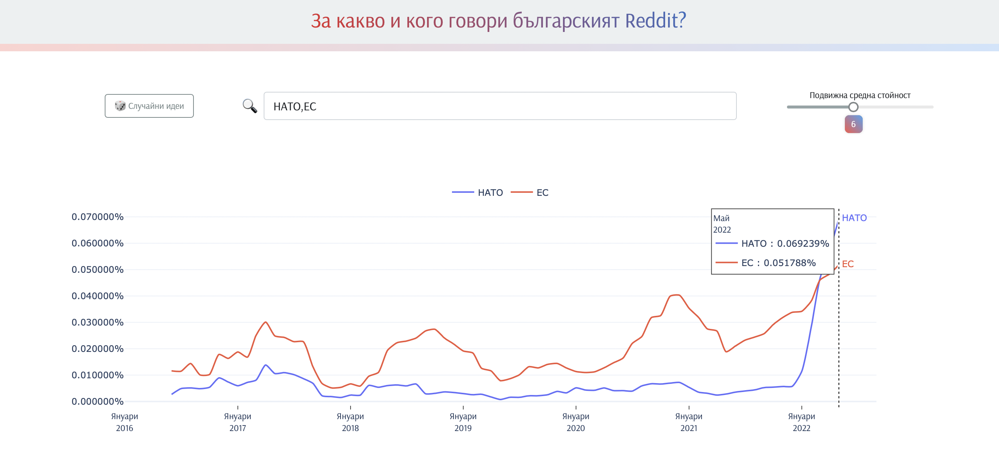

 Коментарите бяха извлечени с помощта на [**subreddit-comments-dl**](https://github.com/pistocop/subreddit-comments-dl).

Обработката на данните и създаването на N-gram модела могат да бъдат разгледани в този [**Jupyter Notebook**](https://github.com/sakelariev/bg-reddit/blob/main/clean_transform_data.ipynb)

Приложението е написано на [Dash](https://plotly.com/dash/) и Python.

{width="3%"} [**Open Source код**](https://github.com/sakelariev/bg-reddit)
