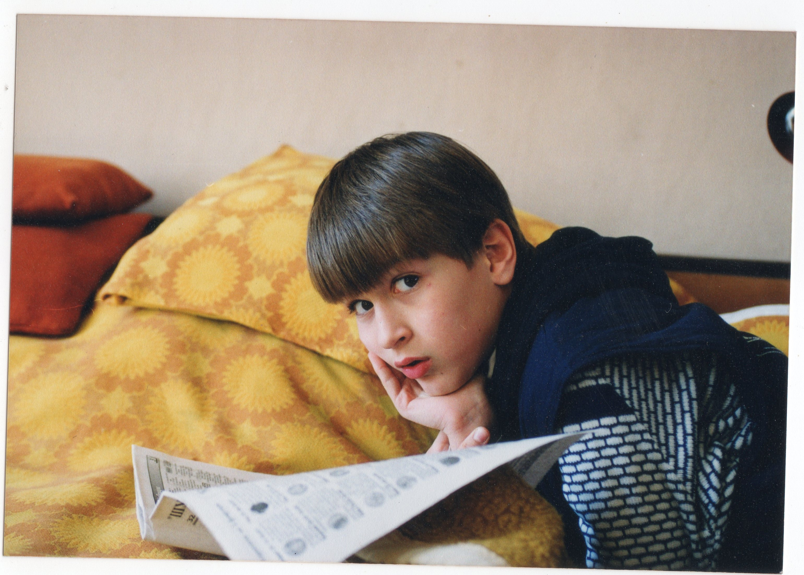

<aside>*Един младеж (на около 11 години), който не пропуска спортните страници на вестник „Шуменска заря" и не осъзнава, че увлеченията по футболни класации и статистики на младини могат да доведат до странно увлечение към статистическия анализ на дърти години.*</aside>

Казвам се Ивайло Сакелариев (🇬🇧 Ivaylo Sakelariev ) и съм роден в Шумен през 1990 година. Като дете мечтаех да стана биолог, режисьор или археолог. Естествено вместо това реших да уча маркетинг. След шест години професионален стаж в сферата на дигиталния маркетинг, открих, че всъщност нямам достатъчно познания за Homo Sapiens, затова реших да уча отново. Докато изучавах психология се оказа, че най-интересни ми бяха статистиката и количествените изследвания. От тогава се занимавам с анализ на хора онлайн --- основно нещата, които споделят, пишат, създават, снимат, харесват, мразят (да го наречем култура). От време на време участвам и във възпроизвеждането на психологически изследвания в България --- [ето едно публикувано в Nature Human Behavior](https://www.nature.com/articles/s41562-021-01092-x).

В момента работя като Data Scientist в [Paperpile](https://paperpile.com) --- софтуер, който помага на учени и изследователи да управляват своите статии, книги и библиографии. Работата ми включва обработка, визуализация и анализ на данни, създаване на аналитични приложения и статистически модели. Основните технологии, с които предпочитам да работя са Python и R --- почти всички анализи или проекти на този уебсайт са правени с тяхна помощ.

През свободното си време обичам да човъркам разни забутани крайчета на "Интернета", да тренирам (основно, за да слушам подкасти), да си седя вкъщи с приятелката ми (наричаме го "нищоправене") и да се мъча да прилагам методи от поведенческите науки върху котката ми Пепър (последното напълно неуспешно 🤷‍♂️).

Можете да ме намерите и тук:

{width="3%"} [Twitter](https://twitter.com/sakelariev "https://twitter.com/sakelariev")

{width="3%"} [Github](https://github.com/sakelariev "https://github.com/sakelariev")

{width="3%"} [Huggingface](https://huggingface.co/sakelariev "https://huggingface.co/sakelariev")

## Образование

-   BAW (Bayerischen Akademie für Werbung und Marketing)\
    Diplom **Kommunikationswirtschaft \|** 2009 -- 2011

-   Шуменски университет „Епископ Константин Преславски"\
    Бакалавър **Връзки с обществеността** \| 2012 -- 2016

-   Софийски Университет „Св. Климент Охридски"\
    Магистър **Обща Психология на английски език \|** 2017 -- 2019

## Професионален опит

-   **Свободна практика и стажове**\
    Фотограф, Видеооператор, Уебдизайнер, PR стажант... \| 2011 - 2014
-   **Агенция за дигитален маркетинг Pixels**\
    Основател и маркетинг директор \| Юли 2014 -- Декември 2020
-   **Junior Researcher Programme\
    **Junior Researcher \| Юни 2018 -- Септември 2019
-   **Paperpile**\
    Data Scientist \| Декември 2020 --

\
*Всички мнения, възгледи и проекти на този уебсайт са само мои и нямат нищо общо с работодателя ми.*
